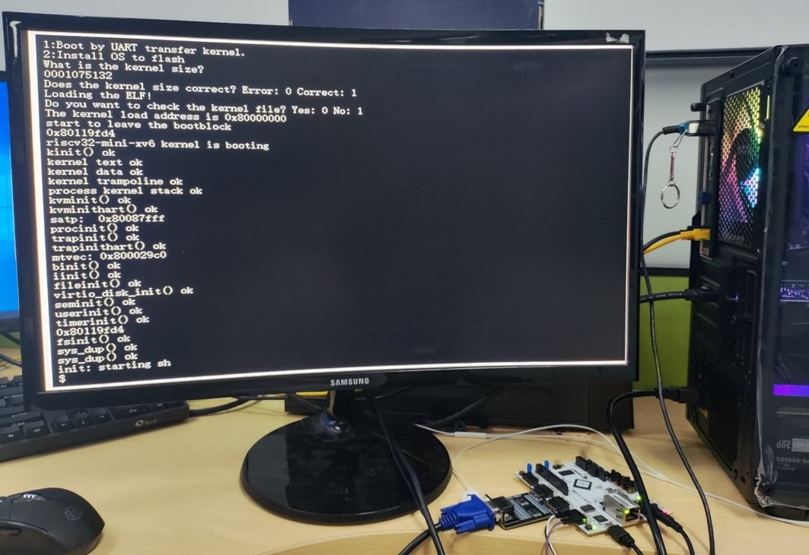

# 简介

基于FPGA的VGA显示适配器，可驱动显示器进行字符显示

使用verilog语言编程，模块设计主要包括帧存储，RAM控制器，字符库和VGA显示控制器几部分。
* 帧存储：用来缓存待显示图形的像素数据。
* RAM控制器：负责控制帧存储的读写。
* 字符库：存储所有字符的点阵数据。
* VGA显示控制器：读取帧存储中的数据并产生VGA信号输出。
* UART控制器：可接收外部数据并通过RAM控制器写入帧存储

# 开发使用工具

* 软件：Vivado18.3，Modelsim DE-64 10.6c
* 硬件：Digilent Arty A7-35T开发板，PMOD-VGA扩展板

# 顶层模块说明

工程的顶层设计文件为vga_top.v，它的接口描述如下表。
|信号名|方向|宽度|功能|备注|
|-|-|-|-|-|
|**sys_clk**|输入|1|系统时钟输入|使用开发板的100M晶振|
|**sys_rst_n**|输入|1|复位信号|低电平复位|
|**rx**|输入|1|串口数据输入|波特率可通过uart_ctl.v中例化的接收模块参数修改|
|**hsync**|输出|1|行同步信号|通过开发板的PMOD接口输出，接PMOD-VGA扩展板|
|**vsync**|输出|1|场同步信号|通过开发板的PMOD接口输出，接PMOD-VGA扩展板|
|**vga_rgb**|输出|12|RGB三基色信号|通过开发板的PMOD接口输出，接PMOD-VGA扩展板|

# 测试

* 使用Arty A7-35T开发板，烧写工程的.bit文件，然后用PMOD-VGA扩展板+VGA线缆连接显示器，在PC上用串口调试工具向FPGA串口发送数据进行测试，结果如下图。
  

* 本设计模块可连接FPGA上的软核处理器或其他硬件处理器，使其系统具备显示功能，处理器通过串口输出待显示字符的ASCII码，显示模块即可驱动显示器显示对应字符。如下图即为在FPGA上用本设计模块连接RISCV软核实现终端字符显示的效果，处理器运行xv6操作系统并将系统终端信息输出打印，实现终端界面显示。
  

